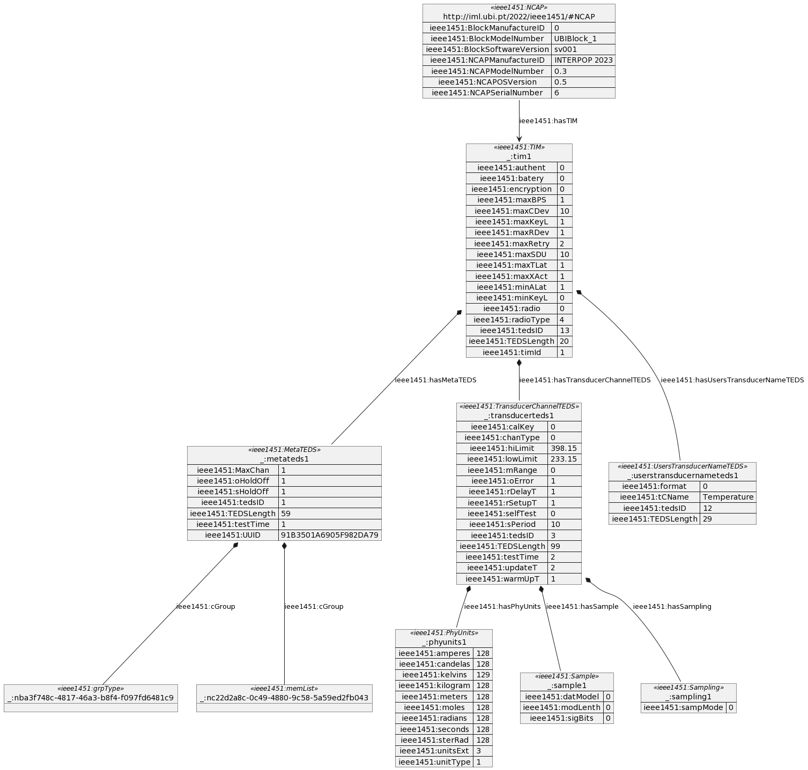

# Comments on contents of RDF file

## Superflous rdf:about

Following statement generates superflous triple:

```
<ieee1451:NCAP rdf:about="http://iml.ubi.pt/2022/ieee1451/#NCAP">
```

as it says that `http://iml.ubi.pt/2022/ieee1451/#NCAP` is a `http://iml.ubi.pt/2022/ieee1451/#NCAP`.

## Generated Triples

The RDF generates the following triples:

```
<http://iml.ubi.pt/2022/ieee1451/#NCAP>	<http://www.w3.org/1999/02/22-rdf-syntax-ns#type>	<http://iml.ubi.pt/2022/ieee1451/#NCAP>
<http://iml.ubi.pt/2022/ieee1451/#NCAP>	<http://iml.ubi.pt/2022/ieee1451/#BlockManufactureID>	"0"
<http://iml.ubi.pt/2022/ieee1451/#NCAP>	<http://iml.ubi.pt/2022/ieee1451/#BlockModelNumber>	"UBIBlock_1"
<http://iml.ubi.pt/2022/ieee1451/#NCAP>	<http://iml.ubi.pt/2022/ieee1451/#BlockSoftwareVersion>	"sv001"
<http://iml.ubi.pt/2022/ieee1451/#NCAP>	<http://iml.ubi.pt/2022/ieee1451/#NCAPManufactureID>	"INTERPOP 2023"
<http://iml.ubi.pt/2022/ieee1451/#NCAP>	<http://iml.ubi.pt/2022/ieee1451/#NCAPModelNumber>	"0.3"
<http://iml.ubi.pt/2022/ieee1451/#NCAP>	<http://iml.ubi.pt/2022/ieee1451/#NCAPSerialNumber>	"6"
<http://iml.ubi.pt/2022/ieee1451/#NCAP>	<http://iml.ubi.pt/2022/ieee1451/#NCAPOSVersion>	"0.5"
_:tim1	<http://www.w3.org/1999/02/22-rdf-syntax-ns#type>	<http://iml.ubi.pt/2022/ieee1451/#TIM>
_:tim1	<http://iml.ubi.pt/2022/ieee1451/#timId>	"1"
_:metateds1	<http://www.w3.org/1999/02/22-rdf-syntax-ns#type>	<http://iml.ubi.pt/2022/ieee1451/#MetaTEDS>
_:metateds1	<http://iml.ubi.pt/2022/ieee1451/#TEDSLength>	"59"
_:metateds1	<http://iml.ubi.pt/2022/ieee1451/#tedsID>	"1"
_:metateds1	<http://iml.ubi.pt/2022/ieee1451/#UUID>	"91B3501A6905F982DA79"
_:metateds1	<http://iml.ubi.pt/2022/ieee1451/#oHoldOff>	"1"
_:metateds1	<http://iml.ubi.pt/2022/ieee1451/#sHoldOff>	"1"
_:metateds1	<http://iml.ubi.pt/2022/ieee1451/#testTime>	"1"
_:metateds1	<http://iml.ubi.pt/2022/ieee1451/#MaxChan>	"1"
_:n4dd21f8c-e60e-4447-9e74-1fa87227f0ad	<http://www.w3.org/1999/02/22-rdf-syntax-ns#type>	<http://iml.ubi.pt/2022/ieee1451/#grpType>
_:metateds1	<http://iml.ubi.pt/2022/ieee1451/#cGroup>	_:n4dd21f8c-e60e-4447-9e74-1fa87227f0ad
_:na650bad9-5c29-4d56-87fc-ec8ce273cd89	<http://www.w3.org/1999/02/22-rdf-syntax-ns#type>	<http://iml.ubi.pt/2022/ieee1451/#memList>
_:metateds1	<http://iml.ubi.pt/2022/ieee1451/#cGroup>	_:na650bad9-5c29-4d56-87fc-ec8ce273cd89
_:tim1	<http://iml.ubi.pt/2022/ieee1451/#hasMetaTEDS>	_:metateds1
_:transducerteds1	<http://www.w3.org/1999/02/22-rdf-syntax-ns#type>	<http://iml.ubi.pt/2022/ieee1451/#TransducerChannelTEDS>
_:transducerteds1	<http://iml.ubi.pt/2022/ieee1451/#TEDSLength>	"99"
_:transducerteds1	<http://iml.ubi.pt/2022/ieee1451/#tedsID>	"3"
_:transducerteds1	<http://iml.ubi.pt/2022/ieee1451/#calKey>	"0"
_:transducerteds1	<http://iml.ubi.pt/2022/ieee1451/#chanType>	"0"
_:phyunits1	<http://www.w3.org/1999/02/22-rdf-syntax-ns#type>	<http://iml.ubi.pt/2022/ieee1451/#PhyUnits>
_:phyunits1	<http://iml.ubi.pt/2022/ieee1451/#unitType>	"1"
_:phyunits1	<http://iml.ubi.pt/2022/ieee1451/#radians>	"128"
_:phyunits1	<http://iml.ubi.pt/2022/ieee1451/#sterRad>	"128"
_:phyunits1	<http://iml.ubi.pt/2022/ieee1451/#meters>	"128"
_:phyunits1	<http://iml.ubi.pt/2022/ieee1451/#kilogram>	"128"
_:phyunits1	<http://iml.ubi.pt/2022/ieee1451/#seconds>	"128"
_:phyunits1	<http://iml.ubi.pt/2022/ieee1451/#amperes>	"128"
_:phyunits1	<http://iml.ubi.pt/2022/ieee1451/#kelvins>	"129"
_:phyunits1	<http://iml.ubi.pt/2022/ieee1451/#moles>	"128"
_:phyunits1	<http://iml.ubi.pt/2022/ieee1451/#candelas>	"128"
_:phyunits1	<http://iml.ubi.pt/2022/ieee1451/#unitsExt>	"3"
_:transducerteds1	<http://iml.ubi.pt/2022/ieee1451/#hasPhyUnits>	_:phyunits1
_:transducerteds1	<http://iml.ubi.pt/2022/ieee1451/#lowLimit>	"233.15"
_:transducerteds1	<http://iml.ubi.pt/2022/ieee1451/#hiLimit>	"398.15"
_:transducerteds1	<http://iml.ubi.pt/2022/ieee1451/#oError>	"1"
_:transducerteds1	<http://iml.ubi.pt/2022/ieee1451/#selfTest>	"0"
_:transducerteds1	<http://iml.ubi.pt/2022/ieee1451/#mRange>	"0"
_:sample1	<http://www.w3.org/1999/02/22-rdf-syntax-ns#type>	<http://iml.ubi.pt/2022/ieee1451/#Sample>
_:sample1	<http://iml.ubi.pt/2022/ieee1451/#datModel>	"0"
_:sample1	<http://iml.ubi.pt/2022/ieee1451/#modLenth>	"0"
_:sample1	<http://iml.ubi.pt/2022/ieee1451/#sigBits>	"0"
_:transducerteds1	<http://iml.ubi.pt/2022/ieee1451/#hasSample>	_:sample1
_:transducerteds1	<http://iml.ubi.pt/2022/ieee1451/#updateT>	"2"
_:transducerteds1	<http://iml.ubi.pt/2022/ieee1451/#rSetupT>	"1"
_:transducerteds1	<http://iml.ubi.pt/2022/ieee1451/#sPeriod>	"10"
_:transducerteds1	<http://iml.ubi.pt/2022/ieee1451/#warmUpT>	"1"
_:transducerteds1	<http://iml.ubi.pt/2022/ieee1451/#rDelayT>	"1"
_:transducerteds1	<http://iml.ubi.pt/2022/ieee1451/#testTime>	"2"
_:sampling1	<http://www.w3.org/1999/02/22-rdf-syntax-ns#type>	<http://iml.ubi.pt/2022/ieee1451/#Sampling>
_:sampling1	<http://iml.ubi.pt/2022/ieee1451/#sampMode>	"0"
_:transducerteds1	<http://iml.ubi.pt/2022/ieee1451/#hasSampling>	_:sampling1
_:tim1	<http://iml.ubi.pt/2022/ieee1451/#hasTransducerChannelTEDS>	_:transducerteds1
_:userstransducernameteds1	<http://www.w3.org/1999/02/22-rdf-syntax-ns#type>	<http://iml.ubi.pt/2022/ieee1451/#UsersTransducerNameTEDS>
_:userstransducernameteds1	<http://iml.ubi.pt/2022/ieee1451/#TEDSLength>	"29"
_:userstransducernameteds1	<http://iml.ubi.pt/2022/ieee1451/#tedsID>	"12"
_:userstransducernameteds1	<http://iml.ubi.pt/2022/ieee1451/#format>	"0"
_:userstransducernameteds1	<http://iml.ubi.pt/2022/ieee1451/#tCName>	"Temperature"
_:tim1	<http://iml.ubi.pt/2022/ieee1451/#hasUsersTransducerNameTEDS>	_:userstransducernameteds1
_:tim1	<http://iml.ubi.pt/2022/ieee1451/#TEDSLength>	"20"
_:tim1	<http://iml.ubi.pt/2022/ieee1451/#tedsID>	"13"
_:tim1	<http://iml.ubi.pt/2022/ieee1451/#radioType>	"4"
_:tim1	<http://iml.ubi.pt/2022/ieee1451/#maxBPS>	"1"
_:tim1	<http://iml.ubi.pt/2022/ieee1451/#maxCDev>	"10"
_:tim1	<http://iml.ubi.pt/2022/ieee1451/#maxRDev>	"1"
_:tim1	<http://iml.ubi.pt/2022/ieee1451/#encryption>	"0"
_:tim1	<http://iml.ubi.pt/2022/ieee1451/#authent>	"0"
_:tim1	<http://iml.ubi.pt/2022/ieee1451/#minKeyL>	"0"
_:tim1	<http://iml.ubi.pt/2022/ieee1451/#maxKeyL>	"1"
_:tim1	<http://iml.ubi.pt/2022/ieee1451/#maxSDU>	"10"
_:tim1	<http://iml.ubi.pt/2022/ieee1451/#minALat>	"1"
_:tim1	<http://iml.ubi.pt/2022/ieee1451/#maxTLat>	"1"
_:tim1	<http://iml.ubi.pt/2022/ieee1451/#maxXAct>	"1"
_:tim1	<http://iml.ubi.pt/2022/ieee1451/#batery>	"0"
_:tim1	<http://iml.ubi.pt/2022/ieee1451/#radio>	"0"
_:tim1	<http://iml.ubi.pt/2022/ieee1451/#maxRetry>	"2"
<http://iml.ubi.pt/2022/ieee1451/#NCAP>	<http://iml.ubi.pt/2022/ieee1451/#hasTIM>	_:tim1
```

## Generated Graph

The RDF generates the following semantic graph:



Rules for how graph was generated:

* Subjects shown as objects in object diagram.
* Literals shown as properties on objects
* Predicates are shown as labels on links to objects, or as property names.
* Prefixed short names used instead of fully qualified names, for readability.
* rdf:type shown as stereotype on object definition.
* Links from blank nodes are shown as aggregations.


## Use of blank nodes for TIMs

Use of Blank Nodes in RDF does not allow for addressing TIMs individually. The TIMS are
physical objects (right?) that should be adressable using linked data directly. As blank
nodes they are only addressable in a specific context (as the RDF document itself).


## On identity of NCAP

The RDF document begins with defining `http://iml.ubi.pt/2022/ieee1451/#NCAP`. Is this
assumed to be an example identity? Or are all NCAPs reporting the same URI?

rbrama: This is, indeed, a nice question. In IEEE P1451.0 we suppose to identify APPs, NCAPs and TIMs by means of their UUID. 
Please note UUIDs have been modified since last official 1451.0 and they are longer (128b). Now, IMHO the NCAP will share the
semantic descriptor URI while they MUST be logically (1451.0) addressable by means of the UUID. How to bind UUIDs with real 
URLs or JIDs (in case of .99) is to be discussed.

### 1451 UUIDs

As noted above UUIDs has changed form the previous version and they are 128b long. Each manufacturer/vendor
can generate freely, without asking to a registrar, a UUID for each of its products. This is possible since
48+24 bits are used to identify location and manufacturer within the location. Following 56 bits identify
the year and the time of production. These UUIDs can be represented as we do in IPv6.

### Proposal for JID addressing

In 1451 family each device (TIMs & NCAPS) and each application is identified by an UUID. This allows to 
use UUIDs as a way to address each member of the 1451 family. However it should be noted that the JID 
associated with each of those UUIDs should not reflect the device but the binding gateway. Each of them
should be identified as per RFC6122 as

   [ localpart "@" ] domainpart [ "/" resourcepart ]
   
where localpart should be used, indeed, to identify one of the bindings (e.g. foo1.1451-99-5),
the domainpart could be used to indicate the "network" (e.g. gws.mynetwork.net) while it could be
the resource part the one used to identify what is bound (e.g. UUIDs/uuidA, or URN/temp1.floor1).

As you can see in the examples my proposal is to use a "descriptor" part, in yhe resourcepart,
indicating hiw we should handle the following part (i.e. wheter it is a UUID or a more user 
friendly name). Of course it will be the .99 binding the one having to "digest" the pointer and 
to associate to it the real identity (and the real address) of the device.

### Leasing UUIDs

When binding non-1451 devices we will have the problem to make the bound devices reachable from
the 1451 network. It is straightforward to understand we shall provide to one of those devices 
a UUID. How can we lease that device? IMHO we have only one way: use a set of geographic coordinates
identifying the leased UUID as such. We could use coordinates in the middle of oceans and bind a subset of them
to each Country in which the leasing binding has been manufactured. UUID Year and time will indicate, in thst case,
the instant in which the UUID has been leased.

In the unlikely event a UUID collision happens we should figure out a way to resolve it. 

## Use of xml:base

Use of xml:base should be used, esp. since document is not retrieved using HTTP GET (where
base URI is implicit). By using xml:base in all such RDF documents, you avoid any concerns
of genering documents that are not well-defined.

## has-properties

### ieee1451:hasTIM

The name of predicate `ieee1451:hasTIM` is counter-intuitive. Sounds like a Boolean property,
but is a collection of TIM blank node objects. Name Suggestion: `ieee1451:TIMs`.

### ieee1451:hasUsersTransducerNameTEDS

The name of predicate `ieee1451:hasUsersTransducerNameTEDS` is counter-intuitive. Sounds like a Boolean property,
but is a collection of User Transducer Name TED blank node objects. Name Suggestion: `ieee1451:UsersTransducerNameTEDS`.

### ieee1451:hasTransducerChannelTEDS

The name of predicate `ieee1451:hasTransducerChannelTEDS` is counter-intuitive. Sounds like a Boolean property,
but is a collection of Transducer Channel TED blank node objects. Name Suggestion: `ieee1451:TransducerChannelTEDS`.

### ieee1451:hasMetaTEDS

The name of predicate `ieee1451:hasMetaTEDS` is counter-intuitive. Sounds like a Boolean property,
but is a collection of Meta TED blank node objects. Name Suggestion: `ieee1451:MetaTEDS`.

## Collections/Sets/Sequences

For sets of objects (samples, TEDs, etc., consider using semantic web standard collections.
This includes declarying type of collection (rdf:Bag, rdf:Seq, etc.), and using rdf:li
list-item predicates.

## Unintuitive names

Following predicate names are unintuitive:

* `cGroup`
* `grpType`
* `memList`

## Data Types of encoded values

Encoded values should have data type specified. Nwo they are all string literals.

## Sample values & units

It is a common implementation strategy to implement a physical magnitute as a collection
of two (or more) fields, at least including magnitute as a numeric value, and unit as a 
string or enumeration. Another alternative is to use the unit as field name (predicate) and
magnitute as value (object literal). This makes all kinds of processing of sample data difficult.

If a two-field approach is used, you can have multiple sample values using the same unit,
but meaning sligly different things: Example: Reporting Voltage in a 3-phase volt-meter often
requires 4 fields using the `V` unit (a total, and one for each phase). Typically, there are
even more fields. Difficulty is creating understandable queries however, and unit conversion.

If a one-field (or predicate) approach is used, queries become simpler, but it is more difficult
to encode meter samples where multiple fields use the same unit. Predicate ovarloads can be
used, but considering use of different units, complexity grows.

An alternative is the ability of semantic web to define data types, that include magnitude
and unit into a single semantic literal value.

Example: Consider a Heat Meter, reporting 3 kinds of temperatures: Flow Temperature (into
the system), Return Temperature (out from system) and Temperature differente (often a magnitute
higher precision, otherwise flow-return temperature). Flow and return temperatures are often
measured in degrees C or F, while difference is often measured in K. But not always.

Consider the complexity of making a semantic query, of retrieving all heat meters reporting
a temperature difference less than 10 degrees C or K (18 degrees F). Apart from having to
struggle with unit conversion, three different temperature field values have to be analyzed.

If instead of having a same value defined as:

```
[ieee1451:FlowTemp "somevalue"^^xsd:decimal;
 ieee1451:FlowTempUnit "someunit";
 ieee1451:ReturnTemp "somevalue"^^xsd:decimal;
 ieee1451:ReturnTempUnit "someunit";
 ieee1451:TempDiff "somevalue"^^xsd:decimal;
 ieee1451:TempDiffUnit "someunit"]
```

or

```
[ieee1451:FlowTempC "somevalue"^^xsd:decimal;
 ieee1451:ReturnTempC "somevalue"^^xsd:decimal;
 ieee1451:TempDiffK "somevalue"^^xsd:decimal]
```

it could be encoded as:

```
[ieee1451:FlowTemp "somevalue"^^ieee1451:C;
 ieee1451:ReturnTemp "somevalue"^^ieee1451:C;
 ieee1451:TempDiff "somevalue"^^ieee1451:K]
```

This would have the following benefits: Reasoners would be able to perform processing
with implicit unit conversion, meaning interoperability between devices using different
physical units on all levels. If a reasoner did not understand the physical unit data types
they could still process information, but as string literals, without making numerical
processing errors, that could occur when mixing units. Another benefit is that it would
be impossible to fraction the tuple (magnitude,unit), or transmit partial or incomplete
data. Magnitude and unit would be engraved together, without loosing the flexibility
of allowing engineers to select what fields and units to use in their applications.
